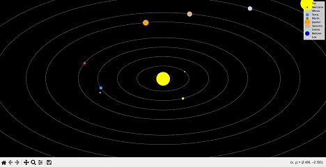

# **Solar_System_Simulation**


This project is an open-source interactive animation of the Solar System using Python with Matplotlib and NumPy. It simulates the orbits of planets and the Moon around the Sun, creating an engaging and visually appealing experience.

## **Features**
- 🌍 Realistic orbits for planets and the Moon
- 🌞 The Sun remains fixed at the center
- 🛰️ Smooth animations using `matplotlib.animation`
- 🎨 Dark theme for a space-like effect

## **Installation**
Make sure you have Python installed, then install the required libraries:

```bash
pip install numpy matplotlib
```
How to Run
Simply execute the script:
```bash
python solar_system.py
````

## **Contributing**
🚀 This project is open for improvements! Feel free to fork, modify, and submit pull requests to:

- Add more celestial bodies
- Improve animation performance
- Enhance visualization with textures or more details
  
## **License**
This project is licensed under the MIT License – you are free to use and modify it.


